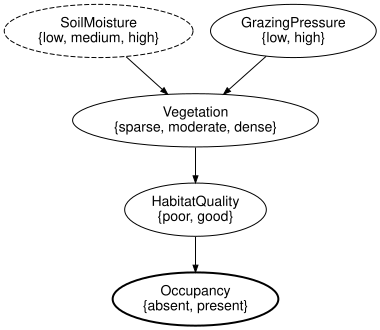
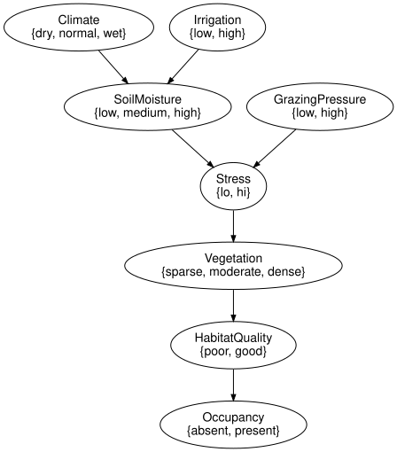

# Open networks and composition
Simon Frost

- [Overview](#overview)
- [Setup](#setup)
- [Splitting the reference network](#splitting-the-reference-network)
- [The typed-interface rule](#the-typed-interface-rule)
- [Sequential composition and
  gluing](#sequential-composition-and-gluing)
- [Tensor and undirected wiring
  diagrams](#tensor-and-undirected-wiring-diagrams)
- [Substitution](#substitution)
- [Semantics of open networks:
  compositionality](#semantics-of-open-networks-compositionality)
- [Structural composition, names and repeated
  ports](#structural-composition-names-and-repeated-ports)
- [Unrolling a dynamic network is
  gluing](#unrolling-a-dynamic-network-is-gluing)
- [Summary](#summary)
- [References](#references)

## Overview

An open Bayesian network is a network with an interface: some variables
are inputs, provided by the environment, and some are outputs, offered
to it. A network whose input variables carry no mechanism of their own
is exactly a causal theory with free inputs ([Fong
2012](#ref-Fong2012)), and the interface is made precise as a structured
cospan ([Baez and Courser 2020](#ref-BaezCourser2020)), the same
construction AlgebraicJulia uses for open dynamical and epidemiological
systems ([Libkind et al. 2022](#ref-Libkind2022)). Open networks compose
by gluing outputs to inputs, and the semantics of the composite is the
composite of the semantics: the kernel of `A` composed with `B` is the
kernel of `A` composed with the kernel of `B`, and likewise for the
tensor (Propositions 2 and 3 of the package specification). This
vignette splits the reference habitat network into an abiotic and a
biotic component, composes them back in several ways, refines a
mechanism by substitution, and checks the propositions numerically.

## Setup

``` julia
using CategoricalBayesianNetworks

m = reference_habitat_model()
ref = reference_habitat_bn()
variable_names(ref)
```

    7-element Vector{Symbol}:
     :Climate
     :Irrigation
     :SoilMoisture
     :GrazingPressure
     :Vegetation
     :HabitatQuality
     :Occupancy

## Splitting the reference network

The abiotic component generates `SoilMoisture` from `Climate` and
`Irrigation`; the biotic component reads `SoilMoisture` and generates
`GrazingPressure`, `Vegetation`, `HabitatQuality` and `Occupancy`. In
the biotic network `SoilMoisture` has no mechanism (`closed = false`
leaves it exogenous).

``` julia
abiotic = bayesnet(:Climate => [:dry, :normal, :wet], :Irrigation => [:low, :high],
                   :SoilMoisture => [:low, :medium, :high];
                   mechanisms = [:SoilMoisture => (:Climate, :Irrigation)])
biotic = bayesnet(:SoilMoisture => [:low, :medium, :high], :GrazingPressure => [:low, :high],
                  :Vegetation => [:sparse, :moderate, :dense], :HabitatQuality => [:poor, :good],
                  :Occupancy => [:absent, :present];
                  mechanisms = [:GrazingPressure => (),
                                :Vegetation => (:SoilMoisture, :GrazingPressure),
                                :HabitatQuality => :Vegetation,
                                :Occupancy => :HabitatQuality],
                  closed = false)
variable_name.(Ref(biotic), exogenous(biotic))
```

    1-element Vector{Symbol}:
     :SoilMoisture

`Open` makes a network open by naming its inputs and outputs. The result
is a Catlab structured cospan ([Baez and Courser
2020](#ref-BaezCourser2020)): the apex is the network, the feet are
`VariableSpace`s (the interface variables with their states) and the
legs embed the feet into the apex.

``` julia
A = Open(abiotic; outputs = [:SoilMoisture])
B = Open(biotic; inputs = [:SoilMoisture], outputs = [:Occupancy])
println(A)
println(B)
```

    OpenBayesNet(3 variables, 3 mechanisms; Symbol[] -> [:SoilMoisture])
    OpenBayesNet(5 variables, 4 mechanisms; [:SoilMoisture] -> [:Occupancy])

``` julia
to_graphviz(B)
```



Inputs are drawn dashed and outputs bold. `input_space(B)` is the foot
itself:

``` julia
variable_names(input_space(B)), states(input_space(B), :SoilMoisture)
```

    ([:SoilMoisture], [:low, :medium, :high])

## The typed-interface rule

Not every choice of interface is allowed. An open network must satisfy
the typed-interface rule: input variables have no mechanism, the input
leg is injective, every mechanism-free variable is an input, the apex is
acyclic, and the legs preserve names, states and positions. Under this
rule the pushouts behind composition never give a variable two
mechanisms. `Open` checks the rule and rejects violations:

``` julia
try
    Open(abiotic; inputs = [:SoilMoisture])       # SoilMoisture has a mechanism
catch e
    sprint(showerror, e)
end
```

    "InterfaceError: rule 1 (every input-foot variable has no mechanism in the apex) is violated by variable(s) SoilMoisture (ids 3)"

``` julia
try
    Open(biotic; outputs = [:Occupancy])          # SoilMoisture is exogenous but not an input
catch e
    sprint(showerror, e)
end
```

    "InterfaceError: rule 3 (every mechanism-free apex variable is an input) is violated by variable(s) SoilMoisture (ids 1)"

## Sequential composition and gluing

`compose` (or `⋅`) is strict: the outputs of the first network must
equal the inputs of the second, position by position, with the same
states. The composite is the pushout of the two apexes along the shared
interface.

``` julia
C = compose(A, B)
inputs(C), outputs(C), sort(variable_names(apex(C)))
```

    (Symbol[], [:Occupancy], [:Climate, :GrazingPressure, :HabitatQuality, :Irrigation, :Occupancy, :SoilMoisture, :Vegetation])

The composite has no free inputs and one output, and its apex is the
reference network again – gluing the two halves along `SoilMoisture`
recovers exactly what was split:

``` julia
canonicalize(apex(C)) == canonicalize(ref)
```

    true

(`ref` is the structure alone, `reference_habitat_bn()`; the apex of `C`
carries the `NoRef` references of its components, whereas `syntax(m)`
carries the `NamedRef`s that `bind_cpt` assigned, so the comparison is
made on the structure.)

A mismatch is reported with the position and the two sides:

``` julia
B2 = Open(rename_variable(biotic, :SoilMoisture => :Moisture);
          inputs = [:Moisture], outputs = [:Occupancy])
try
    compose(A, B2)
catch e
    sprint(showerror, e)
end
```

    "InterfaceMismatchError: compose: outputs(A) vs inputs(B): interfaces differ in variable_name at position 1; left has :SoilMoisture, right has :Moisture"

`glue` composes along explicit pairs of names, which may differ (the
glued variable keeps the name from the first network), and leaves the
other interface variables in place:

``` julia
G = glue(A, B2; along = [:SoilMoisture => :Moisture])
canonicalize(apex(G)) == canonicalize(ref)
```

    true

## Tensor and undirected wiring diagrams

`otimes` (or `⊗`) places networks side by side; the apex is the disjoint
union and the interfaces are concatenated. Names may repeat, which is
fine for the structure but prevents evaluation until variables are
renamed.

``` julia
T = otimes(A, A)
inputs(T), outputs(T), nparts(apex(T), :Variable)
```

    (Symbol[], [:SoilMoisture, :SoilMoisture], 6)

`oapply` composes along an undirected wiring diagram written with
`@relation`: each box receives a network, its ports are the interface
variables (inputs first), and shared junctions are glued. The
typed-interface rule cannot be expressed in an undirected diagram, so it
is checked afterwards.

``` julia
uwd = @relation (occ,) begin
    abiotic(soil)
    biotic(soil, occ)
end
R = oapply(uwd, Dict(:abiotic => A, :biotic => B))
outputs(R), canonicalize(apex(R)) == canonicalize(ref)
```

    ([:Occupancy], true)

## Substitution

`substitute` replaces a mechanism by an open network with the same
interface: the parents as inputs, in order, and the target as output.
Here the `Vegetation` mechanism is refined into a two-step pathway
through a hidden `Stress` variable.

``` julia
two_step = bayesnet(:SoilMoisture => [:low, :medium, :high], :GrazingPressure => [:low, :high],
                    :Stress => [:lo, :hi], :Vegetation => [:sparse, :moderate, :dense];
                    mechanisms = [:Stress => (:SoilMoisture, :GrazingPressure),
                                  :Vegetation => :Stress], closed = false)
N = Open(two_step; inputs = [:SoilMoisture, :GrazingPressure], outputs = [:Vegetation])
S = substitute(ref, :Vegetation_mechanism => N)
sort(variable_names(S)), mechanism_names(S)
```

    ([:Climate, :GrazingPressure, :HabitatQuality, :Irrigation, :Occupancy, :SoilMoisture, :Stress, :Vegetation], [:SoilMoisture_mechanism, :GrazingPressure_mechanism, :HabitatQuality_mechanism, :Occupancy_mechanism, :Climate_mechanism, :Irrigation_mechanism, :Stress_mechanism, :Vegetation_mechanism])

``` julia
to_graphviz(S)
```



The same substitution can be done on the wiring diagram with Catlab’s
`substitute`, and reading the result back gives the same network:

``` julia
d = to_wiring_diagram(ref)
b = findfirst(i -> box(d, i).value.name == :Vegetation_mechanism, box_ids(d))
dS = substitute(d, b, to_wiring_diagram(N))
canonicalize(first(from_wiring_diagram(dS))) == canonicalize(S)
```

    true

On a `BayesModel` the substitution is recorded in the history, and
kernels for the new mechanisms are bound afterwards.

## Semantics of open networks: compositionality

`interpret` gives the kernel `⊗ inputs → ⊗ outputs` of an open network:
the product of its mechanisms’ kernels, summed over the hidden
variables. Kernels are looked up by `KernelRef`, which survives
composition because it is an attribute of the apex; the components above
were built without references, so we look kernels up by target name
instead.

``` julia
by_name = Dict(x => kernel(m, x) for x in variable_names(ref))
kA = interpret(A, by_name)
kB = interpret(B, by_name)
kA.codom, kB.dom, kB.codom
```

    (FiniteSpace(SoilMoisture{low,medium,high}), FiniteSpace(SoilMoisture{low,medium,high}), FiniteSpace(Occupancy{absent,present}))

Sequential compositionality (Proposition 3 of the specification): the
kernel of the composite is the composite of the kernels, so `interpret`
is functorial.

``` julia
interpret(compose(A, B), by_name) ≈ compose(kA, kB)
```

    true

Tensor compositionality (Proposition 2): the kernel of the tensor is the
tensor of the kernels, so `interpret` is monoidal as well.

``` julia
interpret(otimes(A, B), by_name) ≈ otimes(kA, kB)
```

    true

And the composite agrees with the closed model’s own marginal, which is
the reference evaluation of the previous vignette:

``` julia
interpret(C, by_name) ≈ marginal(m, :Occupancy)
```

    true

## Structural composition, names and repeated ports

Names are convenient lookup keys, not a criterion for whether two hidden
components can coexist. `compose` retains its name-safe compatibility
policy; `compose_structural` performs the total structural gluing on
matching valid feet.

``` julia
scalar = Open(bayesnet(:Hidden => [:no, :yes]))
try
    compose(scalar, scalar)
catch e
    sprint(showerror, e)
end
```

    "DuplicateNameError: 2 Variable parts named :Hidden (ids 1, 2)"

``` julia
two_hidden = compose_structural(scalar, scalar)
(variables = variable_names(apex(two_hidden)),
 mechanisms = nparts(apex(two_hidden), :Mechanism),
 valid = validate(two_hidden) === nothing)
```

    (variables = [:Hidden, :Hidden], mechanisms = 2, valid = true)

Both mechanisms remain. A duplicate name is not an instruction to merge
them or discard one. Use part ids, stable kernel references, or explicit
renaming when subsequent APIs require unique names.

Ordered input occurrences also remain distinct even when they carry one
variable:

``` julia
repeated = bayesnet(:X => [:no, :yes], :Y => [:no, :yes];
                   mechanisms = [:Y => (:X, :X)])
same = zeros(2, 2, 2)
for i in 1:2, j in 1:2
    same[i, j, i == j ? 2 : 1] = 1.0
end
rm = bind_cpt(BayesModel(repeated), [:X => [0.4, 0.6], :Y => same])
(slot_count = length(inputs(syntax(rm), mechanism_of(syntax(rm), :Y))),
 copied_value = marginal(rm, :Y).table,
 expression_agrees = categorical_joint(rm) ≈ joint_distribution(rm))
```

    (slot_count = 2, copied_value = [0.0, 1.0], expression_agrees = true)

The factor representation takes the diagonal of the repeated-slot CPT.
The free-expression builder supplies one copy per occurrence and retains
a wire for the original variable. This is one draw used twice, not two
independent draws. Port metadata survives the same representation
boundary:

``` julia
annotated = bayesnet(:Habitat => [:poor, :good];
                    space_refs = Dict(:Habitat => NamedRef("habitat-space")))
back = first(from_wiring_diagram(to_wiring_diagram(annotated)))
(reference = space_ref(back, :Habitat), round_trip = is_isomorphic(annotated, back))
```

    (reference = NamedRef("habitat-space"), round_trip = true)

## Unrolling a dynamic network is gluing

The same machinery explains what `unroll` does to a `DynamicBayesNet`. A
dynamic template is an initial network and a transition network related
by the lag naming convention; `initial_slice` is the initial network
renamed to slice 0 and `transition_slice(dbn, t)` the transition
template seen from slice `t`, with the lagged variables exogenous.
Gluing the outputs of one slice to the inputs of the next is exactly
what `unroll` produces, up to renumbering of parts.

``` julia
dbn = vegetation_herbivore_dbn()
A_0 = Open(initial_slice(dbn); outputs = [:Vegetation_0, :Herbivores_0])
B_1 = Open(transition_slice(dbn, 1); inputs = [:Vegetation_0, :Herbivores_0],
           outputs = [:Vegetation_1, :Herbivores_1])
G = glue(A_0, B_1;
         along = [:Vegetation_0 => :Vegetation_0, :Herbivores_0 => :Herbivores_0])
canonicalize(apex(G)) == canonicalize(unroll(dbn, 1))
```

    true

`unroll` builds the network directly rather than by repeated pushouts,
because that is faster and keeps the names predictable, but both test
suites keep the two constructions in agreement. Dynamic networks are the
subject of a vignette of `BayesianNetworks.jl`.

## Summary

`Open` presents a network as a structured cospan, so composition is a
pushout of ACSets rather than renaming by hand, and the typed-interface
rule is the condition under which that pushout can never give one
variable two mechanisms. `compose`, `glue`, `otimes`, `oapply` and
`substitute` are all built from that one idea, and `interpret` sends
each of them to the corresponding operation on finite stochastic
kernels, which is what makes building a large model out of reviewed
pieces safe; unrolling a dynamic network is one more instance of the
same gluing. Serialisation and provenance, dynamic networks and model
cards continue in `BayesianNetworks.jl`’s own vignettes.

## References

<div id="refs" class="references csl-bib-body hanging-indent">

<div id="ref-BaezCourser2020" class="csl-entry">

Baez, John C., and Kenny Courser. 2020. “Structured Cospans.” *Theory
and Applications of Categories* 35 (48): 1771–822.

</div>

<div id="ref-Fong2012" class="csl-entry">

Fong, Brendan. 2012. *Causal Theories: A Categorical Perspective on
Bayesian Networks*. <https://arxiv.org/abs/1301.6201>.

</div>

<div id="ref-Libkind2022" class="csl-entry">

Libkind, Sophie, Andrew Baas, Micah Halter, Evan Patterson, and James P.
Fairbanks. 2022. “An Algebraic Framework for Structured Epidemic
Modelling.” *Philosophical Transactions of the Royal Society A* 380
(2233): 20210309. <https://doi.org/10.1098/rsta.2021.0309>.

</div>

</div>
