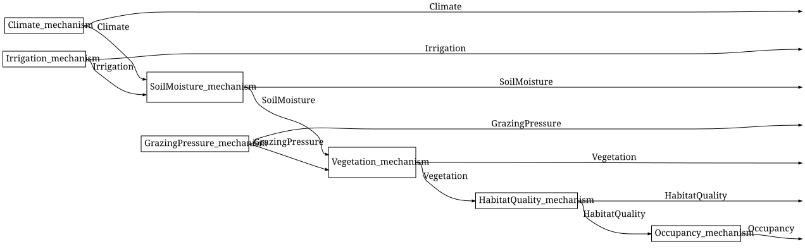
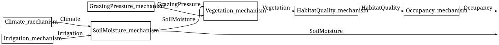

# Wiring diagrams and evaluation
Simon Frost

- [Overview](#overview)
- [Setup](#setup)
- [The wiring-diagram view](#the-wiring-diagram-view)
- [From diagrams to expressions](#from-diagrams-to-expressions)
- [Evaluation: two routes to the same
  joint](#evaluation-two-routes-to-the-same-joint)
- [Sampling](#sampling)
- [Summary](#summary)
- [References](#references)

## Overview

A Bayesian network is a string diagram in a Markov category ([Fritz
2020](#ref-Fritz2020); [Cho and Jacobs 2019](#ref-ChoJacobs2019)): each
mechanism is a box `κ : P_1 ⊗ ... ⊗ P_k → X`, a variable read by several
mechanisms is copied, and a variable that is not reported is discarded.
This vignette draws the reference network as a Catlab wiring diagram,
turns it into a free-category expression, evaluates that expression in
the category of finite stochastic kernels, and checks that the result
agrees with the brute-force joint distribution – that is, that the
categorical evaluator and the chain-rule product of the conditional
probability tables ([Koller and Friedman 2009](#ref-KollerFriedman2009))
give the same joint state (Proposition 1 of the package specification).

## Setup

`CategoricalBayesianNetworks.jl` re-exports everything in
`BayesianNetworks.jl`, so this one `using` gives both the structural
layer and the categorical one. The reference model of
`BayesianNetworks.jl`’s first vignette, “Bayesian networks as networks
of mechanisms”, supplies both the syntax and the kernels.

``` julia
using CategoricalBayesianNetworks
using Random

m = reference_habitat_model()
bn = syntax(m)
nparts(bn, :Variable), nparts(bn, :Mechanism)
```

    (7, 7)

## The wiring-diagram view

`to_wiring_diagram` builds a `WiringDiagram` with one box per mechanism.
Ports carry a `VariablePort` (name and states) and boxes a
`MechanismBox` (name and kernel reference). A wire runs from the port
that produces a variable to every port that consumes it: fan-out is an
implicit copy, and an output port that no wire leaves is an implicit
discard, which is how a wiring diagram encodes the `mcopy` and `delete`
of a Markov category without drawing them as boxes.

``` julia
d = to_wiring_diagram(bn)
nboxes(d), nwires(d)
```

    (7, 13)

Each box carries the mechanism it came from, so the diagram is not an
anonymous graph:

``` julia
box(d, 5)
```

    Box(Vegetation_mechanism, [SoilMoisture{low,medium,high},GrazingPressure{low,high}], [Vegetation{sparse,moderate,dense}])

By default the outer inputs are the exogenous variables (none, for a
closed network) and the outer outputs are all the other variables in
topological order, so the diagram is a state
`I → Climate ⊗ ... ⊗ Occupancy`. Catlab’s Graphviz renderer draws it,
with the labels of the network:

``` julia
to_graphviz(d)
```



`SoilMoisture` fans out to the `Vegetation` box and to the outer output.
Choosing the outputs changes the interface: here every variable but
`Occupancy` and `SoilMoisture` is discarded.

``` julia
to_graphviz(to_wiring_diagram(bn; outputs = [:Occupancy, :SoilMoisture]))
```



The view is invertible on the diagrams it produces (flat diagrams of
single-output boxes with typed ports):

``` julia
bn2, ins, outs = from_wiring_diagram(d)
canonicalize(bn2) == canonicalize(bn), ins, outs
```

    (true, Symbol[], [:Climate, :Irrigation, :SoilMoisture, :GrazingPressure, :Vegetation, :HabitatQuality, :Occupancy])

## From diagrams to expressions

A wiring diagram is a graphical presentation of a morphism;
`to_hom_expr` turns it into a term of `FreeMarkovCategory`, the free
Markov category generated by one object per variable and one morphism
per mechanism. Catlab’s algorithm normalises fan-out into `mcopy` and
dangling wires into `delete`, then reduces the diagram by series and
parallel composition.

``` julia
expr = to_hom_expr(FreeMarkovCategory, d)
dom(expr), codom(expr)
```

    (munit(), otimes(Climate,Irrigation,SoilMoisture,GrazingPressure,Vegetation,HabitatQuality,Occupancy))

The package also builds such expressions directly from the syntax,
without going through a diagram. `to_free_expression` adds one variable
at a time in topological order, copying the parents’ wires, braiding the
copies to the right, and applying the mechanism’s generator (“keep
everything”); `wiring_expression` does the same from a wiring diagram
and, unlike Catlab’s reduction, also handles boxes whose outputs are all
discarded.

``` julia
expr2 = to_free_expression(m)
expr3 = wiring_expression(d)
codom(expr) == codom(expr2) == codom(expr3)
```

    true

The expressions differ syntactically (there are many ways to write the
same string diagram) but denote the same morphism, as the evaluation
below shows.

## Evaluation: two routes to the same joint

`free_generators` interprets the generators in FinStoch: each variable
name goes to its `FiniteSpace`, each mechanism name to its
`FiniteKernel`. MarkovCategories’ `evaluate` then applies the functor to
the expression.

``` julia
gens = free_generators(m)
gens[:Vegetation_mechanism]
```

    FiniteKernel{Float64}(SoilMoisture{low,medium,high} ⊗ GrazingPressure{low,high} → Vegetation{sparse,moderate,dense})
                low,low  medium,low  high,low  low,high  medium,high  high,high
      sparse        0.6         0.2      0.05       0.8          0.4        0.2
      moderate      0.3         0.5       0.3      0.15         0.45        0.5
      dense         0.1         0.3      0.65      0.05         0.15        0.3

Applying the functor to the whole expression gives a state
`I → Climate ⊗ ... ⊗ Occupancy`, whose codomain lists the variables in
the order the diagram reports them:

``` julia
J_cat = evaluate(expr, gens)
J_cat.codom
```

    FiniteSpace(Climate{dry,normal,wet} ⊗ Irrigation{low,high} ⊗ SoilMoisture{low,medium,high} ⊗ GrazingPressure{low,high} ⊗ Vegetation{sparse,moderate,dense} ⊗ HabitatQuality{poor,good} ⊗ Occupancy{absent,present})

`categorical_joint` packages this for `to_free_expression`, and
`joint_distribution` computes the joint by brute force, enumerating
every assignment and multiplying the mechanisms’ tables. The claim
(Proposition 1 of the package specification) is that the two agree: the
joint distribution equals the product of the conditional probability
tables, whether that product is taken by enumeration or by the functor
from the free Markov category into **FinStoch**. The test suite checks
it on random networks and here it holds on the reference network for all
three expressions:

``` julia
J = joint_distribution(m)
(J_cat ≈ J, categorical_joint(m) ≈ J, evaluate(expr3, gens) ≈ J)
```

    (true, true, true)

The diagram with only two outputs evaluates to the corresponding
marginal:

``` julia
d2 = to_wiring_diagram(bn; outputs = [:Occupancy, :SoilMoisture])
evaluate(to_hom_expr(FreeMarkovCategory, d2), gens) ≈ marginal(m, [:Occupancy, :SoilMoisture])
```

    true

Because the joint is a `FiniteKernel`, the usual queries are kernel
operations. `marginal` and `conditional` do them for a model (the first
argument is the model, evidence can be passed):

``` julia
marginal(m, :Occupancy).table
```

    2-element Vector{Float64}:
     0.5237590625000001
     0.47624093750000007

`conditional` returns a kernel rather than a number, so a single entry
is read off with `probability`; extracting such a kernel from a joint
state is disintegration ([Cho and Jacobs 2019](#ref-ChoJacobs2019)):

``` julia
probability(conditional(m, :Occupancy, :Vegetation), :present, :dense)
```

    0.6675

## Sampling

`sample` draws ancestrally in topological order. With enough samples the
empirical frequencies approach the marginal:

``` julia
rng = MersenneTwister(2026)
draws = sample(m, 20_000; rng = rng)
draws[1]
```

    Dict{Symbol, Symbol} with 7 entries:
      :Vegetation      => :dense
      :GrazingPressure => :low
      :HabitatQuality  => :good
      :SoilMoisture    => :medium
      :Occupancy       => :present
      :Climate         => :wet
      :Irrigation      => :low

``` julia
emp = empirical_marginal(draws, :Occupancy, space(m, :Occupancy))
round.(emp.table; digits = 3), round.(marginal(m, :Occupancy).table; digits = 3)
```

    ([0.524, 0.476], [0.524, 0.476])

``` julia
maximum(abs.(emp.table .- marginal(m, :Occupancy).table)) < 0.02
```

    true

## Summary

The wiring-diagram view is invertible on the diagrams the package
produces, and both it and `to_free_expression` compile a network into a
term of `FreeMarkovCategory` whose `mcopy` and `delete` make the sharing
and the discarding explicit. Evaluating that term in **FinStoch** gives
the same joint state as enumerating every assignment and multiplying the
conditional probability tables, so the categorical evaluator is a
second, independent implementation of the semantics. The next vignette,
[Open networks and
composition](../02_open_networks_and_composition/02_open_networks_and_composition.md),
gives networks an interface and composes them. Observation versus
intervention, which uses this semantics to separate conditioning from
the `do` operator, is a vignette of `BayesianNetworks.jl`.

## References

<div id="refs" class="references csl-bib-body hanging-indent">

<div id="ref-ChoJacobs2019" class="csl-entry">

Cho, Kenta, and Bart Jacobs. 2019. “Disintegration and Bayesian
Inversion via String Diagrams.” *Mathematical Structures in Computer
Science* 29 (7): 938–71. <https://doi.org/10.1017/S0960129518000488>.

</div>

<div id="ref-Fritz2020" class="csl-entry">

Fritz, Tobias. 2020. “A Synthetic Approach to Markov Kernels,
Conditional Independence and Theorems on Sufficient Statistics.”
*Advances in Mathematics* 370: 107239.
<https://doi.org/10.1016/j.aim.2020.107239>.

</div>

<div id="ref-KollerFriedman2009" class="csl-entry">

Koller, Daphne, and Nir Friedman. 2009. *Probabilistic Graphical Models:
Principles and Techniques*. MIT Press.

</div>

</div>
